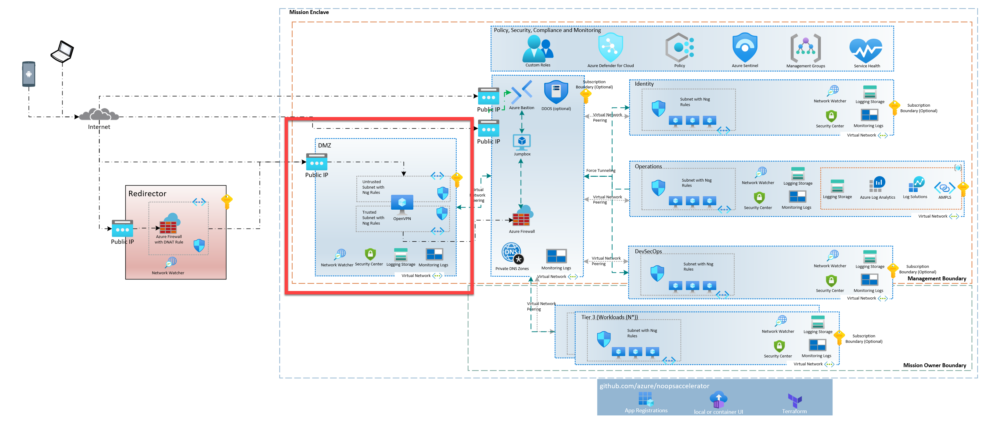
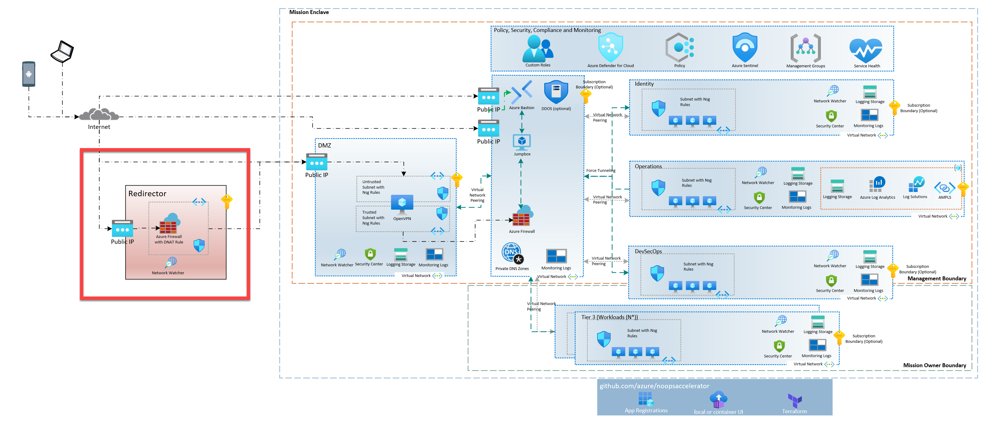

# Encrypted Transport for SCCA-Compliant Enclave Reference Add-on Module


[](LICENSE) [](https://registry.terraform.io/modules/azurenoops/overlays-dmz-spoke/azurerm/)

## Overview

This reference implementation was created to provide VPN services to people using the [Azure NoOps Reference SCCA Enclave Landing Zone Starter ](https://github.com/azurenoops/ref-scca-enclave-landing-zone-starter) or a similar SCCA-compliant landing zone, such as the [Mission Landing Zone](https://github.com/Azure/missionlz).  The intent is to make it easy to add VPN services to an existing SCCA-compliant enclave.  This starter is not intended to be used as a standalone VPN solution as it requires an SCCA-compliant Hub (VNet, Firewall, & Log Analytics Workspace) to be deployed first so that it can peer to the Hub virtual network and push logs to the Log Analytics Workspace.

This add-on module uses Terraform to deploy an Encrypted Transport system that supports two modes:  

1. OpenVPN DMZ Spoke attached to an SCCA compliant Hub (greenfield or brownfield).
2. OpenVPN DMZ Spoke attached to an SCCA compliant Hub (greenfield or brownfield) with a traffic redirector that provides Azure-owned Fiber backhaul from an edge region in Azure Commercial to the Hub region in Azure Commercial or Government.

Mode 1 is a straight-forward OpenVPN Server VM that can be accessed directly from the Internet over it's public IP address.  This mode is useful for local deployments or for quick testing.  Mode 2 is a more complex deployment that uses an Azure Firewall to redirect traffic from the edge region to the Hub region.  This mode is useful for deployments where latency is a concern as the encrypted VPN traffic travels between the redirector and DMZ over the Microsoft-owned [Azure Global Network](https://azure.microsoft.com/en-us/explore/global-infrastructure/global-network/).

### PKI

 All certificates for the VM's SSH and for OpenVPN Server and Client configuration are the responsibility of the user.  This module does not create or manage any certificates although it does allow you to pass them into the Terraform so that the OpenVPN Server can be configured on first-boot.

### Overall Solution Architecture  

The following diagram shows the overall solution architecture for the Encrypted Transport Add-on. The main components are the DMZ Spoke and one or more Redirectors. The DMZ Spoke is deployed into the same region as the Hub and the Redirectors are deployed into an Azure Commercial region that is geographically close to the end users / VPN users. This placement ensures that the user's traffic is routed over Azure-owned fiber back to the Hub region, which reduces overall latency.  

[](docs/images/EnclaveLZ-with-Encrypted-Transport-Architecture-Selected.png)

### Resources Deployed

This reference implementation deploys the following resources:

#### Enclave-side DMZ Resources

- DMZ Resource Group
- DMZ Virtual Network
  - Untrusted Subnet  
    - Untrusted NSG  
    - Untrusted Route Table (UDR)
  - Trusted Subnet
    - Trusted NSG
    - Trusted Route Table (UDR)
- DMZ Key Vault
  - Private Endpoint
  - Private DNS Zone
- DMZ OpenVPN VM
  - OpenSUSE 15.2 Image
  - NIC on the Untrusted Subnet
  - NIC on the Trusted Subnet
  - OpenVPN deployed and configured on first boot (cloud-init)
  - Public IP Address linked to Untrusted NIC on Untrusted subnet

#### Edge-side Redirector Resources

- Redirector Resource Group in Azure Commercial Region (ex. South Africa North, UK South, etc.)
- Public IP for the Azure Firewall
- Redirector Virtual Network
  - AzureFirewall Subnet
- Azure Firewall  
  - DNAT rules as the traffic redirector

#### DMZ Spoke with OpenVPN Server Architecture

The DMZ Spoke contains a virtual network that is peered to an SCCA-compliant Hub VNet. Inside the virtual network are two subnets, named _Untrusted_ and _Trusted_ respectively.  

The _Untrusted_ subnet has a Network Security Group (NSG) that only allows inbound traffic on Port 443.  The _Untrusted_ subnet also has a Route Table with a rule that sends all incoming traffic, that is not bound for the Enclave, to the Internet.  

The _Trusted_ subnet also has an NSG that is configured to only allow traffic coming from the VPN Client IP address range to access the Enclave networks.  The _Trusted_ subnet also has a Route Table with a rule that sends all incoming trafficto the firewall in the Enclave Hub.

The OpenVPN Server is an OpenSUSe Linux VM that has two network interface cards (NICs).  One NIC is attached to the _Untrusted_ subnet and the other NIC is attached to the _Trusted_ subnet.  The OpenVPN Server is configured to listen for incoming VPN connections on Port 443 and to route traffic from the VPN Client IP address range to the Enclave firewall.  The OpenVPN Server is also configured use the Enclave firewall as its DNS server.  

[](docs/images/DMZ-Architecture-Selected.png)

#### Redirector Architecture

The Redirector component contains a virtual network with a single subnet named _AzureFirewallSubnet_.  The Redirector also contains an Azure Firewall (Basic) that is configured to redirect incoming traffic on Port 443 to the OpenVPN Server public IP in the DMZ Spoke.  The redirection is accomplished by the use of a DNAT Rule within the Azure Firewall Policy.  

The Redirector is deployed into an Azure Commercial region that is geographically close to the VPN Clients.  This placement ensures that the user's traffic is routed over Azure-owned fiber back to the DMZ region, which reduces overall latency.  

[](docs/images/Redirector-Architecture-Selected.png)

## Deployment process

### Mode 1 - OpenVPN Server in the DMZ Spoke

1. Open the code in the `dmz_spoke_openvpn` folder.  
2. Update the variables in your `.tfvars` file. You can copy the contents of the `deploy.test.tfvars` file into your file as a starter.  
    1. The inputs for this deployment can be found below in the __DMZ with OpenVPN Server Deployment__ section.  
3. Run `terraform init` to initialize the Terraform environment.
4. Run `terraform plan -var-file=<your .tfvars file> -out="deploy.tfplan` to see what resources will be created.
5. Run `terraform apply "deploy.tfplan"` to create the resources.
6. After the code has run successfully, Terraform will output the Public IP address of the OpenVPN Server in the `openvpn_public_ip` output variable.  This value can be used to connect to the OpenVPN Server from the Internet.  

### Mode 2 - OpenVPN Server in the DMZ Spoke with Redirector at the Edge

1. Follow the steps in __Mode 1 - OpenVPN Server in the DMZ Spoke__ above.
2. Once the DMZ is deployed, note the `openvpn_public_ip` output variable from Step 6 above.
3. Create a folder under the `redirect_spoke` folder and create a subfolder for the Azure Commercial region where you want to deploy the Redirector.  For example, if you want to deploy the Redirector in UK South, you would create a folder named `redirect_spoke\uksouth`.
    1.  If you are deploying the Redirector into South Africak North or UAE North, you can use the existing folders and simply modify the `tfvars` files there.
4. Copy the code from the `redirect_spoke\southafricanorth` folder into your new folder.  
5. Update the variables in your `.tfvars` file.
    1. The inputs for this deployment can be found below in the __Redirector Deployment__ section.  
6. Run `terraform init` to initialize the Terraform environment.
7. Run `terraform plan -var-file=<your .tfvars file> -out="deploy.tfplan` to see what resources will be created.
8. Run `terraform apply "deploy.tfplan"` to create the resources.
9. Once the Redirector code has run successfully, Terraform will output the Public IP address of the Azure Firewall in the `redirector_spoke_public_ip_address` output variable.  This value can be used to connect to the Redirector Firewall from the Internet.

## SCCA Compliance

This module deploys resources in an SCCA compliant manner and can be integrated into an existing SCCA compliant enclave. Enabling private endpoints and applying SCCA compliant network rules makes it SCCA compliant.

For more information, please read the [SCCA documentation]("https://www.cisa.gov/secure-cloud-computing-architecture").

## DMZ with OpenVPN Server Deployment

### Prerequisites

#### Permissions for peering to the Hub virtual network

To peer spoke virtual networks to the hub virtual network requires the user/service principal that performs the peering to have the `Network Contributor` role on the hub virtual network. When linking the Spoke to the Hub DNS zones, the user/service principal also needs the `Private DNS Zone Contributor` role on the hub virtual network. If a Log Analytics workspace was created in the hub or another subscription then the user/service principal must also have the `Log Analytics Contributor` role on the workspace or a custom role to connect the new resources to the workspace.

> NOTE: This module will add the `Network Contributor` role and `Private DNS Zone Contributor` role, if you are using DNS Zones as part of the deployment.  

#### Terraform variables

To deploy this reference implementation you must have the following information and files available to you:

##### Deployment variables

1. The name of your Enclave Hub Resource Group (containing the Firewall and Virtual Network).
2. The name of your Enclave Loging Resource Group (containing the Log Analytics Workspace).
3. The name of your Hub Virtual Network.
4. The name of your Hub Firewall.
5. The Private IP address of your Hub Firewall.
6. The name of your Hub Log Analytics Workspace.
7. The name of your Hub Storage Account.
8. The SubscriptionId of your Hub Resource Group.
9. The SubscriptionId of the Subscription that will house the DMZ Spoke.

##### OpenVPN Server and VM PKI files

1. The OpenVPN Server VM's SSH public key file.
2. The OpenVPN Server VM's SSH private key file.
3. The OpenVPN Server CA Root Certificate file.
4. The OpenVPN Server Diffie-Hellman parameters file.
5. The OpenVPN Server Public Key file.
6. The OpenVPN Server Private Key file.

### Example DMZ Spoke Deployment Usage

The code below is from the `/dmz_spoke_openvpn/Commercial/deploy.test.tfvars` file.  Each parameter is described below.

```hcl
required = {
  org_name           = "anoa"
  deploy_environment = "dev"
  environment        = "public"
}

location      = "eastus"
workload_name = "openvpn"

dmz_subscription_id                             = "<< Enter your DMZ Subscription ID here >>"
hub_subscription_id                             = "<< Enter your Hub Subscription ID here >>"

// The names below (except the Storage Acct) are the default names used by the SCCA Enclave Landing Zone Starter.  Change to match your deployment.
hub_virtual_network_name                        = "anoa-eus-hub-core-dev-vnet"
hub_resource_group_name                         = "anoa-eus-hub-core-dev-rg"
hub_firewall_name                               = "anoa-eus-hub-core-dev-fw"
hub_log_analytics_workspace_resource_group_name = "anoa-eus-ops-mgt-logging-dev-rg"
hub_log_analytics_workspace_name                = "anoa-eus-ops-mgt-logging-dev-log"


####################################################
#
#    DMZ Transport Spoke
#
####################################################

dmz_vnet_address_space = ["10.14.0.0/24"]
dmz_vnet_subnets = {
  untrusted = {
    name                                       = "untrusted"
    address_prefixes                           = ["10.14.0.0/27"]
    service_endpoints                          = ["Microsoft.Storage", "Microsoft.KeyVault"]
    private_endpoint_network_policies_enabled  = false
    private_endpoint_service_endpoints_enabled = true

    nsg_subnet_rules = [
      {
        name                       = "AllowAnyHTTPSInbound",
        description                = "Allow access to port 443",
        priority                   = 100,
        direction                  = "Inbound",
        access                     = "Allow",
        protocol                   = "*",
        source_port_range          = "*",
        destination_port_range     = "443",
        source_address_prefix      = "*",
        destination_address_prefix = "*"
      }
    ]
  }
  trusted = {
    name                                       = "trusted"
    address_prefixes                           = ["10.14.0.32/27"]
    service_endpoints                          = ["Microsoft.Storage", "Microsoft.KeyVault"]
    private_endpoint_network_policies_enabled  = false
    private_endpoint_service_endpoints_enabled = true

    nsg_subnet_rules = [
      {
        name                   = "AllowVPNClientTraffictoEnclave",
        description            = "Allow VPN Clients to access the networks in the Enclave.",
        priority               = 100,
        direction              = "Outbound",
        access                 = "Allow",
        protocol               = "*",
        source_port_range      = "*",
        destination_port_range = "*",
        source_address_prefix  = "10.3.0.0/16",
        destination_address_prefixes = [
          "10.8.0.0/16"
        ]
      }
    ]
  }
}


#############################################################
##
##  OpenVPN Servers
##
#############################################################
openvpn_client_address_prefix = "10.3.0.0/16"

// The two variables below are used to configure the KeyVault that will house the OpenVPN Server's Private SSH Key and make it available to users from Bastion. If you are not accessing the OpenVPN Server from Bastion through the internet then you can clear the 'kv_ip_allow_list' list.
kv_admin_group_object_id = "<< AAD Group GUID here >>"
kv_ip_allow_list         = []

openvpn_server_vm_admin_username       = "azureuser"
openvpn_server_vm_ssh_public_key_path  = "~/.ssh/ovpn-server-vm.key.pub"
openvpn_server_vm_ssh_private_key_path = "~/.ssh/ovpn-server-vm.key"

openvpn_ca_root_cert_path                = "~/.ssh/openvpn/ca.crt"
openvpn_dh_cert_path                     = "~/.ssh/openvpn/dh.pem"
openvpn_server_public_key_path           = "~/.ssh/openvpn/osopenvpn.crt"
openvpn_server_private_key_path          = "~/.ssh/openvpn/osopenvpn.key"
openvpn_server_private_key_password_path = "~/.ssh/openvpn/osopenvpn.key.password"
openvpn_client_dns_server_address        = "10.8.4.68"

```

## General Parameters

Reference implementations of the Azure NoOps tooling use a built-in naming convention that is based on the Organizaton name, Workload Name, Deployment Region, Deployment Type, and Resource Type.  

The following variables are used for the entire deployment including generating names for the deployed resources.

Parameter name | Default Value | Description
-------------- | ------------- | -----------
`required.org_name` | None |  The name of the organizaton owning the Enclave.  This is used to generate the names of the deployed resources.
`required.deploy_environment` | None | The name of the deployment environment, like _Dev_, _Test_, or _Prod_. This can be any string value you like.  This is used to generate the names of the deployed resources.
`required.environment` | None | The name of the deployment environment, like _Public_ or _Private_. This can be any string value you like.  This is used by Terraform to target the correct Azure Cloud APIs. This is also used to generate the names of the deployed resources.
`location` | None | The Azure region where the resources will be deployed.  This is also used to generate the names of the deployed resources.
`workload_name` | None | The name of the workload you are deploying.  This is used to generate the names of the deployed resources.
`dmz_subscription_id` | None | The Subscription ID of the Subscription that will house the DMZ Spoke.
`hub_subscription_id` | None | The Subscription ID of the Subscription that will houses the Enclave Hub. Ths is where Terraform will look for the Hub Firewall, Hub VNet, and Log Analytics Workspace.
`hub_virtual_network_name` | None | The name of the Hub Virtual Network. This is the network that the DMZ VNet will Peer with.
`hub_resource_group_name` | None | The name of the Hub Resource Group. This is the existing resource group where the Hub Virtual Network and Hub Firewall are deployed.
`hub_firewall_name` | None | The name of the Hub Firewall. This is the existing firewall that the DMZ's _Trusted_ subnet will route traffic to. This is also the DNS provider for the OpenVPN Clients.
`hub_log_analytics_workspace_resource_group_name` | None | The name of the Hub Log Analytics Workspace Resource Group. This is the existing resource group where the Hub Log Analytics Workspace is deployed.
`hub_log_analytics_workspace_name` | None | The name of the Hub Log Analytics Workspace. This is the existing Log Analytics Workspace that the DMZ will send logs to.


## DMZ Transport Spoke Networking Parameters
 
The DMZ Spoke Networking is deployed in its own REsource Group and is peered to an existing SCCA Hub/Spoke architecture. The Starter creates a DMZ Spoke virtual network with two, required subnets.  The virtual network is peered back to the existing Hub virtual network and NSG rules and Route tables are created. The Route tables on the Trusted subnet force-tunnel all traffic to the Hub Firwall.

The following parameters affect DMZ Spoke Networking.  

Parameter name | Default Value | Description
-------------- | ------------- | -----------
`virtual_network_address_space` | '10.0.100.0/24' | The CIDR Virtual Network Address Prefix for the DMZ Spoke Virtual Network.
`dmz_vnet_subnets` | See below | A map of subnets to create in the DMZ Spoke Virtual Network.  The map key is the name of an individual subnet and the map value is the subnet parameters.  See the __Additional DMZ Spoke Resource Parameters__ section below for the documentation of the subnet parameters.

### Subnets

This Starter creates two subnets on the new virtual network which are defined in the `dmz_vnet_subnets` variable block.  

> NOTE:  
The _Untrusted_ and _Trusted_ subnets and their associated NSG rules are defined in the test TFVars file.  These are the minimum settings that you need to pass to the Starter to configure the DMZ Spoke and they are required to exist exactly as defined.  We have not hard-coded these into the Starter so that you can add to them if needed. Please do not remove these minimum entries.

If you need additional subnets, you can add them to the `dmz_vnet_subnets` variable block.  If you need additional subnet rules, you can add those to the `nsg_subnet_rules` block for the appropriate subnet.

### Additional DMZ Spoke Resource Parameters

For detailed information about the DMZ networking variables, please see the [Azure NoOps DMZ Spoke Overlay Module](https://registry.terraform.io/modules/azurenoops/overlays-dmz-spoke/azurerm/latest) in the Terrform Registry or the [Azure DMZ Spoke Overlay Terraform Code - Readme](https://github.com/azurenoops/terraform-azurerm-overlays-dmz-spoke/blob/main/README.md) on GitHub.

## OpenVPN Server Parameters

The OpenVPN Server is an Azure Virtual Maching running OpenSUSe v15.5.  The OpenVPN Server is configured to listen for incoming VPN connections on Port 443 on the Public IP  attached to the _Untrusted_ subnet.  It is configured with user-provided certificates (PKI) to decrypt the VPN tunnel and route traffic from the VPN Client IP address range to the Enclave firewall through the _Trusted_ subnet and the DMZ VNet Peering to the Hub VNet.  The OpenVPN Server is also configured use the Enclave firewall as its DNS server.

To configure the OpenVPN Server, you must provide the following parameters:

Parameter name | Default Value | Description
-------------- | ------------- | -----------
`kv_admin_group_object_id` | None | The Object ID of the Azure AD Group that will be granted access to the Key Vault that will house the OpenVPN Server's Private SSH Key.
`kv_ip_allow_list` | None | A list of IP addresses that will be granted access to the Key Vault that will house the OpenVPN Server's Private SSH Key. This is needed if you are deploying this code from a machine that is not on the Enclave network.  If you are deploying from a VM in the Enclave or from a subnet that has visibility to the Key Vault's Private Endpoint, you can leave this list empty.
`openvpn_server_vm_admin_username` | azureuser | The username that will be used to access the OpenVPN Server VM.
`openvpn_server_vm_ssh_public_key_path` | None | The path to the OpenVPN Server VM's SSH public key file on the deployment machine. The public key must be in a text file and the file must be readable by the user running Terraform.
`openvpn_server_vm_ssh_private_key_path` | None | The path to the OpenVPN Server VM's SSH private key file on the deployment machine. This key will be placed into a Secret in the key vault so that it is available for selection from the Bastion connection window. The private key must be in a text file and the file must be readable by the user running Terraform.
`openvpn_ca_root_cert_path` | None | The path to the OpenVPN Server CA Root Certificate file on the deployment machine.The CA Root Certificate must be in a text file and the file must be readable by the user running Terraform.
`openvpn_dh_cert_path` | None | The path to the OpenVPN Server Diffie-Hellman parameters file on the deployment machine. The parameters file must be in a text file and the file must be readable by the user running Terraform.
`openvpn_server_public_key_path` | None | The path to the OpenVPN Server Public Key file on the deployment machine. The public key must be in a text file and the file must be readable by the user running Terraform.
`openvpn_server_private_key_path` | None | The path to the OpenVPN Server Private Key file on the deployment machine.  The private key must be configured with a password. The private key must be in a text file and the file must be readable by the user running Terraform.
`openvpn_server_private_key_password_path` | None | The path to the OpenVPN Server Private Key Password text file on the deployment machine. This is required to decrypt the OpenVPN Server Private Key. The password must be in a text file and the file must be readable by the user running Terraform.
`openvpn_client_dns_server_address` | None | The IP address of the DNS server that the OpenVPN Server and its VPN Clients will use to resolve DNS names in the Enclave.  This is typically the IP address of the Enclave Firewall.


## Other resources

* [Hub-spoke network topology in Azure](https://docs.microsoft.com/en-us/azure/architecture/reference-architectures/hybrid-networking/hub-spoke)
* [Microsoft Federal - Azure NoOps Terraform Registry](https://registry.terraform.io/namespaces/azurenoops)
* [Terraform AzureRM Provider Documentation](https://www.terraform.io/docs/providers/azurerm/index.html)